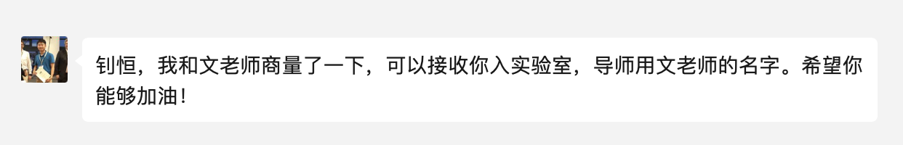

---

layout: post
title:  "2021-Week30"
date:   2021-07-25 16:15:10 +0800
categories: jekyll update

---

## Week 30: 2021.7.19 ~ 2021.7.25

上周日（7.18）抵达杭州，调研结束后在周五匆匆忙忙回家了。南京疫情突然严重起来，核酸检测报告迟迟不出，不得不在酒店多住了一天。

我承认，选择参加游学营是想逃避或缓解夏令营放榜临近的紧张情绪。周一下午，室友自己去西湖，我则躺床上午休了，没过多久就收到了服务器的通知——高瓴的官网数据有更新！我一看果然是放榜了，喜提直博的第四名。晚上约了雨欣吃饭然后去浙大玩。

后来一直在思索选导师的事情。直到周三，最终和窦老师商量好了加入实验室，尘埃落定。

周四听了组会，感觉自己的水平差距还有点大，同年级的同学都开始准备着手写论文了。这个暑假也许就是弯道超车的好机会。我需要花时间精力进一步打好python基础、熟悉深度学习的相关理论、读paper。因此我把电脑上的游戏全都卸载了，为了还给自己一个宁静的内心。

这周主要做的事情比较琐碎，读完了《三联爱乐》四月刊（不得不说，爱乐的阅读门槛越来越高了，连格里高利圣咏的谱记法都有讲解），开始整理本科期间的所有图片文件、网页书签等，打算将其归类、整理清楚。同时，希望能让手机和平板上都装好vpn，并熟悉相关操作，这样就可以通过不同终端浏览外网的论坛了。

接下来，期待能利用实验室服务器搭建一个线上的jupyter平台，这样我的ipad就可以连接到实验室服务器跑程序了。下周最好能开始读论文，这样组会能有内容可以汇报。

